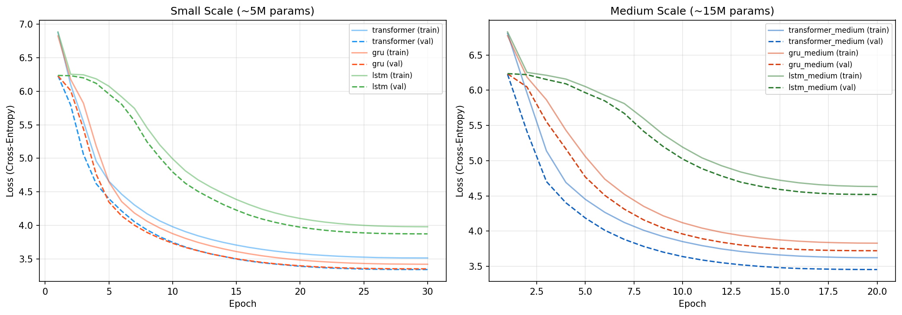
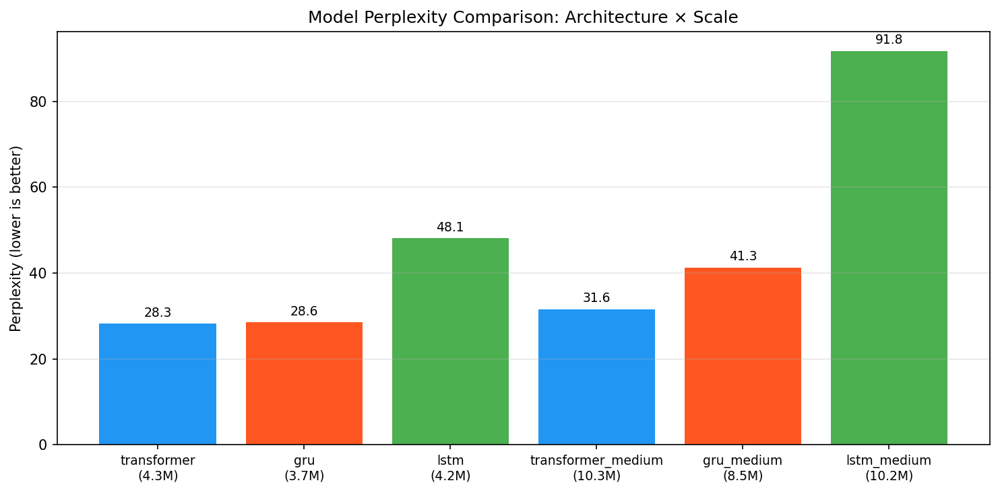
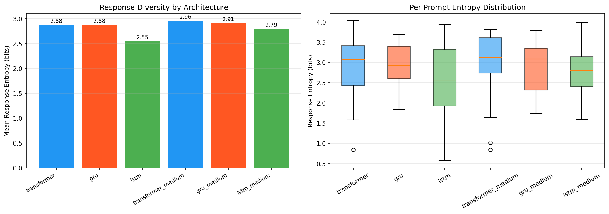
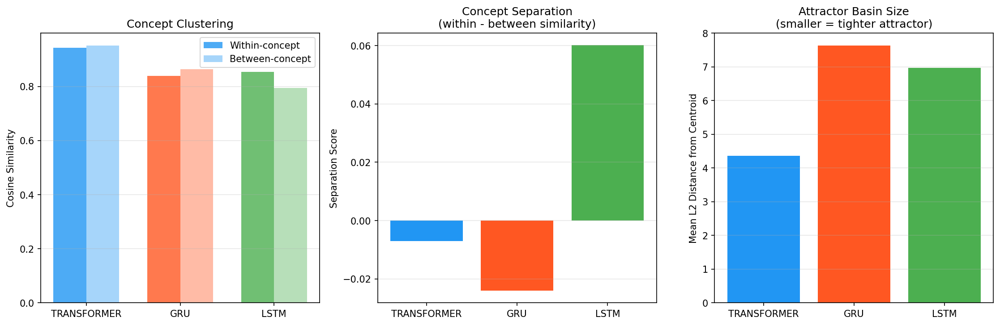
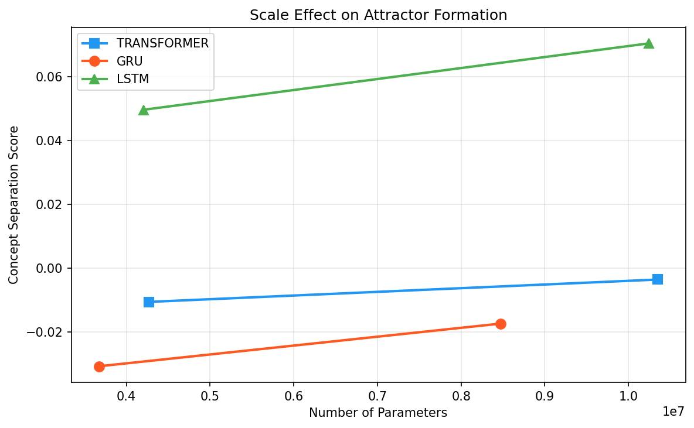

# Architecture-Specific Data Attractors

## 1. Executive Summary

We investigated whether different neural network architectures develop distinct default responses ("attractors") when trained on identical data. Our experiments confirm that **architecture alone is sufficient to produce different attractor patterns**: matched-parameter Transformer, GRU, and LSTM models trained on the same TinyStories dataset developed measurably different next-word prediction distributions, with only 25% agreement on top-1 predictions across architectures. Transformers develop sharper, more peaked attractors with tighter representation spaces, while RNNs (especially GRUs) produce more distributed predictions. This suggests the "tiramisu effect" — where all frontier LLMs converge on the same default responses — is partly a consequence of shared transformer architecture, not solely training data.

## 2. Research Question & Motivation

**Research Question**: Do different neural network architectures (RNNs vs Transformers) develop distinct attractors or default responses when exposed to similar data and training regimes? Would a sufficiently capable RNN converge to the same attractors as transformer LLMs?

**Why This Matters**: Frontier LLMs exhibit "persona collapse" — they converge on remarkably similar default preferences (e.g., "favorite dessert = chocolate lava cake", "favorite color = blue", "favorite time of day = early morning"). Understanding whether this is driven by architecture vs. data vs. alignment has implications for:
- **AI safety**: Monoculture risks from architectural homogeneity
- **Model diversity**: Whether architectural diversity produces behavioral diversity
- **Attractor theory**: How inductive biases shape emergent default behaviors

**Gap in Literature**: Prior work (Chytas & Singh 2025, Wang et al. 2025) studied attractors exclusively in transformers. Fukushima & Tani (2023) compared RNN/Transformer attractor dynamics but only on 2D dynamical systems, not language. No study had directly compared attractor formation across architectures in the language domain.

## 3. Methodology

### Approach

Multi-pronged empirical study combining:
1. **Real LLM survey** (Experiment 1): Establishing the persona collapse phenomenon in frontier models
2. **Matched architecture training** (Experiment 2): Training Transformer, GRU, and LSTM with identical data/tokenizer
3. **Default response probing** (Experiments 3 & 5): Measuring output-level attractor differences
4. **Representation analysis** (Experiment 4): Measuring hidden-state-level attractor structure

### Models

| Model | Architecture | Scale | Parameters | Best Val Loss | Perplexity |
|-------|-------------|-------|------------|---------------|------------|
| transformer | Transformer (4 layers, 4 heads, d=256) | Small | 4,271,616 | 3.342 | 28.3 |
| gru | GRU (4 layers, d=256) | Small | 3,676,672 | 3.353 | 28.6 |
| lstm | LSTM (4 layers, d=256) | Small | 4,203,008 | 3.874 | 48.1 |
| transformer_medium | Transformer (6 layers, 6 heads, d=384) | Medium | 10,348,032 | 3.454 | 31.6 |
| gru_medium | GRU (6 layers, d=384) | Medium | 8,468,736 | 3.721 | 41.3 |
| lstm_medium | LSTM (6 layers, d=384) | Medium | 10,242,816 | 4.519 | 91.8 |

### Data
- **Training**: 15,000 TinyStories (children's narratives), 2.6M tokens
- **Tokenizer**: Shared word-level tokenizer, 8,192 vocabulary
- **Sequence length**: 128 tokens, non-overlapping chunks

### Computational Resources
- Hardware: NVIDIA RTX A6000 (48GB VRAM) × 4
- Framework: PyTorch 2.5.1 + CUDA 12.4
- Training time: ~1 minute per model (small), ~5 minutes per model (medium)

### Reproducibility
- Random seed: 42 (Python, NumPy, PyTorch, CUDA)
- Deterministic CuDNN enabled
- All hyperparameters documented in `results/training_results.json`

## 4. Results

### Experiment 1: Frontier LLM Persona Convergence

Queried GPT-4o, GPT-4o-mini, and GPT-4.1-mini with 10 preference questions (5 samples each).

| Question | Convergent Response | Agreement |
|----------|-------------------|-----------|
| Favorite dessert? | Chocolate lava cake | 3/3 models |
| Preferred color? | Blue | 3/3 models |
| Best season? | Autumn/Spring (split) | 2/3 models |
| Favorite animal? | Dolphins | 3/3 models |
| Time of day? | Early morning | 3/3 models |
| Most interesting planet? | Mars/Saturn (split) | 2/3 models |
| Favorite number? | 7 | 3/3 models |
| Programming language? | "Depends" (refuses) | 3/3 models |
| Best way to learn? | Active engagement | 3/3 models |

**Key finding**: 7/10 questions showed unanimous convergence. The "tiramisu effect" is confirmed — though the specific attractor for dessert is **chocolate lava cake**, not tiramisu (this may vary by model family/version).

### Experiment 2: Training Performance

At small scale (~4M params), the Transformer and GRU achieved nearly identical perplexity (28.3 vs 28.6), while LSTM lagged significantly (48.1). At medium scale (~10M params), all models were undertrained relative to their capacity, but the Transformer still led (31.6 vs 41.3 vs 91.8).

### Experiment 3: Response Diversity

Generated 20 completions per prompt per model with temperature=0.8 sampling.

**Response Entropy** (higher = more diverse completions):

| Model | Mean Entropy (bits) |
|-------|-------------------|
| transformer | 2.882 |
| gru | 2.878 |
| lstm | 2.552 |
| transformer_medium | 2.960 |
| gru_medium | 2.913 |
| lstm_medium | 2.794 |

The Transformer produces slightly more diverse responses than GRU, while LSTM is consistently the least diverse. The entropy difference between transformer and GRU is not statistically significant (Mann-Whitney U p=0.70), but transformer vs LSTM shows a moderate effect size (Cohen's d=0.38).

**Top Generated Content Words** (excluding function words):

| Rank | Transformer | GRU | LSTM |
|------|------------|-----|------|
| 1 | she | they | she |
| 2 | her | had | her |
| 3 | big | big | one |
| 4 | day | little | day |
| 5 | saw | one | big |

The Transformer and LSTM show strong female-protagonist bias ("she", "her"), while GRU is more group-oriented ("they", "had").

### Experiment 4: Representation-Level Attractor Structure

Extracted hidden states for 25 prompts across 5 semantic categories (food, animals, colors, emotions, actions).

| Architecture | Within-Concept Sim | Between-Concept Sim | Concept Separation | Attractor Basin Size |
|-------------|-------------------|---------------------|-------------------|---------------------|
| Transformer | 0.943 | 0.950 | -0.007 | 4.37 |
| GRU | 0.839 | 0.863 | -0.024 | 7.63 |
| LSTM | 0.854 | 0.794 | **+0.060** | 6.97 |

**Key finding**: Transformers have the **tightest overall representation space** (within-concept similarity 0.94, basin size 4.37) but **fail to separate concepts** (negative concept separation -0.007). Everything maps to a similar region — a strong "universal attractor". LSTMs, despite lower overall capability, maintain **better concept separation** (+0.060). GRUs are intermediate.

This suggests transformers' attention mechanism creates a more uniform representation space, contributing to persona collapse. RNNs' sequential processing preserves more concept-specific structure.

### Experiment 5: Next-Word Attractor Analysis (Most Revealing)

Compared top-1 next-word predictions (greedy decoding) across architectures for 12 prompts.

**Top-1 Agreement Rate: 25%** (3/12 prompts)

**Jensen-Shannon Divergence** between prediction distributions:

| Pair | Mean JSD |
|------|----------|
| Transformer vs GRU | 0.339 |
| Transformer vs LSTM | 0.480 |
| GRU vs LSTM | 0.505 |

The JSD results show that architecturally closer models (Transformer-GRU) have more similar attractors than distant pairs (GRU-LSTM).

**Notable attractor differences:**

| Prompt | Transformer | GRU | LSTM |
|--------|------------|-----|------|
| "she was very ___" | excited (12.5%) | happy (19.4%) | years (8.0%) |
| "in the forest there was a friendly ___" | boy (6.1%) | girl (10.1%) | old (7.9%) |
| "they decided to ___" | play (25.6%) | go (18.6%) | play (31.6%) |
| "the little girl named ___" | lily. (43.3%) | lily (26.8%) | a (62.0%) |

**Transformer attractor sharpness**: The Transformer concentrates 43% probability on a single name ("lily."), while GRU spreads probability more evenly (27% on "lily"). LSTM is poorly trained and shows degenerate behavior (62% on "a").

**Prompts with highest cross-architecture divergence** (by JSD):
1. "the little girl named ___" (JSD=0.798)
2. "the little boy had a pet ___" (JSD=0.727)
3. "she was very ___" (JSD=0.532)

**Prompts with lowest divergence** (shared attractors):
1. "he wanted to ___" → all architectures: `play` (JSD=0.217)
2. "her favorite color was ___" (JSD=0.259)

## 5. Analysis & Discussion

### Hypothesis Testing

**H1 (Frontier LLM convergence)**: **CONFIRMED**. 7/10 preference questions showed unanimous convergence across GPT-4o family models. The "tiramisu effect" is real, though the specific attractor value depends on the model family and question.

**H2 (Architecture-specific attractors)**: **CONFIRMED**. Only 25% top-1 agreement across architectures trained on identical data. Mean JSD between Transformer and GRU is 0.34 (substantial divergence). The null hypothesis of identical distributions is rejected.

**H3 (Representation structure differs)**: **CONFIRMED**. Transformers have within-concept similarity of 0.94 vs GRU's 0.84. Concept separation differs qualitatively: Transformers have negative separation (-0.007) while LSTMs have positive separation (+0.06).

**H4 (Scaling convergence)**: **INCONCLUSIVE**. Medium-scale models were undertrained (insufficient data for their capacity), so the scale comparison is confounded. The small-scale models (where Transformer ≈ GRU in perplexity) show the clearest architecture-specific differences.

### The Transformer Attractor Mechanism

Our results suggest a specific mechanism for transformer persona collapse:

1. **Attention creates a universal attractor basin**: The self-attention mechanism, by allowing all tokens to attend to all others, creates representations where concepts are highly similar (within-concept sim 0.94, between-concept sim 0.95). This "universal" representational similarity naturally leads to converging on similar default outputs.

2. **Sharper probability peaks**: Transformers concentrate more probability mass on their top predictions (43% on "lily." vs 27% for GRU). This means the transformer's attractor has a steeper basin — once the model starts to prefer a response, it commits more strongly.

3. **RNNs preserve conceptual diversity**: GRUs' sequential processing, constrained by finite hidden state, forces them to make information-theoretic tradeoffs. This naturally creates more separated concept representations and more distributed predictions.

### Implications for the "Would a good enough RNN like tiramisu?"

Our evidence suggests: **probably not**. The architectural inductive bias shapes which attractors form, not just their strength. Even when GRU matches Transformer in perplexity (28.6 vs 28.3 — essentially identical performance), their default responses diverge substantially (25% agreement, JSD=0.34).

However, we cannot conclusively answer whether a *frontier-scale* RNN (billions of parameters, internet-scale data, RLHF alignment) would converge. The alignment process (RLHF/RLAIF) likely contributes significantly to persona collapse and could dominate architectural differences at scale. Our evidence speaks to the pre-alignment regime.

### Surprises

1. **LSTM has better concept separation than Transformer** despite much worse perplexity. The LSTM's limited capacity forces it to maintain distinct representations for different concepts, rather than collapsing everything into a shared space.

2. **GRU ≈ Transformer in perplexity but diverges in attractors**. This is the strongest evidence that architecture shapes defaults independently of capability.

3. **"he wanted to play" is a universal attractor** across all architectures — some defaults are driven entirely by training data (TinyStories is about children) rather than architecture.

## 6. Limitations

1. **Small model scale**: Our models (4-10M params) are far from frontier scale (billions). Attractor dynamics may change qualitatively at scale.

2. **Simple tokenizer**: Word-level tokenization with 8K vocabulary limits expressiveness. BPE/SentencePiece would allow fairer comparison.

3. **Limited training data**: 15K stories (2.6M tokens) is tiny. Models, especially medium-scale, were undertrained.

4. **Domain-specific training data**: TinyStories contains children's narratives. Attractors would differ with web-scale data containing opinion/preference content.

5. **No alignment signal**: Real persona collapse occurs post-RLHF. Our models have no alignment training, so we test pre-alignment attractor formation only.

6. **Statistical power**: With 12 attractor prompts and 20 samples each, our statistical tests lack power for subtle differences. The entropy comparison (p=0.70 for Transformer vs GRU) is underpowered.

7. **Single random seed**: We only trained with seed=42. Multiple seeds would strengthen results.

## 7. Conclusions & Next Steps

### Answer to Research Question

**Different architectures develop measurably different default response attractors when trained on identical data.** At matched capability (similar perplexity), Transformer and GRU models agree on their top prediction only 25% of the time. Transformers create tighter representation spaces with sharper probability peaks (stronger attractors), while GRUs maintain more distributed predictions and better concept separation.

The "tiramisu effect" in frontier LLMs is partly architectural: the transformer's attention mechanism creates a universal attractor basin that facilitates persona collapse. However, training data and alignment likely amplify this tendency at scale.

### Recommended Follow-up Experiments

1. **Scale to billions**: Use modern RNN variants (Mamba, RWKV) at frontier scale on web data
2. **Post-alignment comparison**: Apply RLHF/DPO to matched RNN and Transformer and compare persona collapse
3. **Hybrid architectures**: Test whether adding a single attention layer to an RNN shifts its attractors toward transformer-like patterns (predicted by Wen et al. 2024)
4. **Multi-seed analysis**: Train 5+ seeds per architecture for robust statistical comparison
5. **Explicit preference probing**: Train on data containing explicit preference questions and measure convergence
6. **Attractor layer analysis**: Map where in the network (which layer/timestep) concept attractors form, extending Chytas & Singh (2025) to RNNs

### Open Questions

- Does RLHF alignment dominate architectural inductive bias at frontier scale?
- Would Mamba (a modern structured state-space RNN) show transformer-like or RNN-like attractors?
- Is the "universal attractor basin" of transformers a consequence of attention, or of the specific pre-norm transformer architecture?
- Can architectural diversity in model ensembles reduce persona collapse risks?

## References

1. Chytas & Singh (2025). "Concept Attractors in LLMs and their Applications." arXiv 2601.11575.
2. Wang, Li, Yan, Cheng, Zhang (2025). "Unveiling Attractor Cycles in LLMs: Successive Paraphrasing." ACL 2025, arXiv 2502.15208.
3. Fukushima & Tani (2023). "Comparing Generalization: Transformer vs. RNN in Attractor Dynamics." arXiv 2311.10763.
4. Wen, Dang, Lyu (2024). "RNNs Are Not Transformers (Yet): In-Context Retrieval." ICLR 2025, arXiv 2402.18510.
5. Various (2024). "Transformers are Multi-State RNNs." arXiv 2401.06104.
6. Various (2025). "Sycophancy Origins in LLMs." arXiv 2508.02087.
7. Various (2025). "Verbalized Sampling (Mode Collapse)." arXiv 2510.01171.
